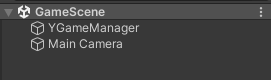
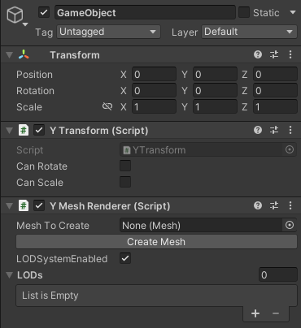
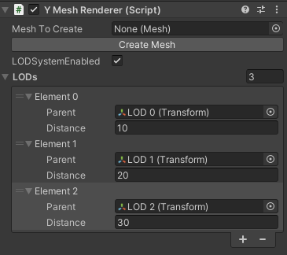
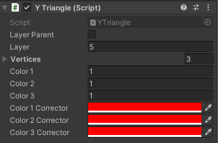
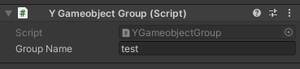
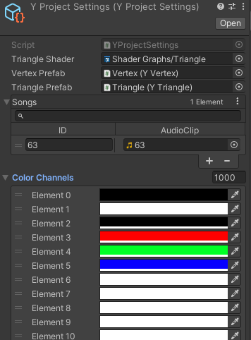

#   YObject
Unity to GD tool

## 🚀 Philosophy

The core principles behind YObject:

- Almost the same approach to game creation as in Unity
- Group objects "see" global objects but global objects doesn't "see" group objects
- Gameobjects can't be parents of other gameobjects


## 🛠️ Quick Start
For a quick start you need to have YGameManager and Camera with YMainCamera component on scene.



Let's get started with adding simple cube on scene. You can create an empty gameobject and put YMeshRenderer on it. Then you can put mesh on this object by selecting mesh and pressing "Create Mesh".



Then you can create YMonoBehaviour (NOT MonoBehaviour) class (it will be your component). Implement there Init, Begin and Tick methods.
- In Init you can create variables, objects, coroutines etc.
- In Begin you can create triggers that will activate at start of game (or when group is loaded if gameobject has a group)
- In Tick you can create triggers that will activate every tick
```cs
public class MyComponent : YMonoBehaviour
{
    private YVariable cameraRotationSpeed;
    public override void Begin()
    {
        YCoroutines.StartCoroutine(yCoroutine);

        new ColorTrigger(3, 1, Color.black);

        new SongTrigger(467339, 0, 1, false, 0, 0, 0, 0);
    }
    private Coroutine yCoroutine;
    public override void Init()
    {
        // creating variable
        cameraRotationSpeed = new YFloat(2.5f);

        GetComponent<YTransform>().Init();

        // creating coroutine
        YCoroutines.RecordCoroutine();

        new YWaitForSeconds(3);
        GetComponent<YTransform>().SetPosition(0f, 0, 0);
        new YWaitForSeconds(1);
        GetComponent<YTransform>().SetPosition(1f, 1, 1);
        new YWaitForSeconds(1);
        GetComponent<YTransform>().SetPosition(2f, 2, 2);
        new YWaitForSeconds(1);
        GetComponent<YTransform>().SetPosition(3f, 3, 3);

        yCoroutine = YCoroutines.GetCoroutine();
    }

    public override void Tick()
    {
        // free fly camera

        new Condition(YInputService.Get().P1Left())
            .Then(() =>
            {
                YMainCamera.Instance.Rotate(0, cameraRotationSpeed, 0);
            });
        new Condition(YInputService.Get().P1Right())
            .Then(() =>
            {
                YMainCamera.Instance.Rotate(0, new YFloat(-1) * cameraRotationSpeed, 0);
            });
        new Condition(YInputService.Get().P1Up())
            .Then(() =>
            {
                YMainCamera.Instance.TranslateLocal(0, 0, 0.1f);
            });
    }
}
```

#### To export game to GD level you need to click "Create Level" button in the YGameManager
!!! geometry dash must be closed and after export you can open it !!!

## 🧩 Core Concepts & Features

### 🧱 GameObjects
- Every item in the game world is a GameObject.
- Objects are organized into groups or located in global world.
- Groups can be loaded/unloaded.

### 🧬 Component System
- Each GameObject holds a set of modular components.
- Components define behavior and data.
```cs
public class TestComponent : YMonoBehaviour
{

    public override void Begin()
    {
        // On gameobject start its game cycle

        // Use for setting default state of gameobject
    }

    public override void Init()
    {
        // Initialize gameobject

        // Use for creating gameobject properties (variables)
        // and for low-level gd objects creating
    }

    public override void Tick()
    {
        // On every tick

        // Use for making game logic
    }
}
```

### 🛠️ YGameManager Functions
```cs
// Record triggers created by commands
YGameManager.Instance.RecordPool();
// Stops recording and returns recorded triggers
YGameManager.Instance.StopRecordPool();
```

### 📊 Variables Usage
- YVariable
    ```cs
    // You can get global variables using this
    YVariable deltaTime = new YVariable("Time.deltaTime");
    ```
- YInt
    ```cs
    // You can create Int variable using this
    YVariable intVar = new YInt(10);
    ```
- YFloat
    ```cs
    // You can create Int variable using this
    YVariable floatVar = new YFloat(1.25f);
    ```


### 🧩 Main Triggers For Code Logic
- ColorTrigger
    ```cs
    new ColorTrigger(3, 1, Color.black);
    // ColorTrigger(int id, float duration, Color color)
    ```
- SongTrigger
    ```cs
    new SongTrigger(467339, 0, 1, false, 0, 0, 0, 0);
    // SongTrigger(int id, int channel, float volume, bool loop,
    // int startMs, int endMs, int fadeInMs, int fadeOutMs)
    ```
- RandomTrigger
    ```cs
    new RandomTrigger(50f, GetComponent<YTransform>().Translate(0.1f, 0, 0), GetComponent<YTransform>().Translate(-0.1f, 0, 0));
    // RandomTrigger(float percentage,
    // YTrigger[] triggers1, YTrigger[] triggers2)
    ```
- DebugLog
    ```cs
    new DebugLog("Debug message");
    // DebugLog(string text)
    // DebugLog(YVariable variable)
    ```
- Condition
    ```cs
    new Condition(YInputService.Get().P1Up())
        .Then(() =>
        {
            YMainCamera.Instance.TranslateLocal(0, 0, 0.1f);
        });
    // Condition(YVariable result)
    // Condition(YVariable var1, YVariable var2, ItemCompare.Operation operation)
    ```
- YWaitForSeconds
    ```cs
    new YWaitForSeconds(1);
    // YWaitForSeconds(float seconds)
    ```

### 🧭 Built-in Components
- YTransform: Position, Rotation, Scale
    ```cs
    yTransform = GetComponent<YTransform>();
    // get YTransform from gameobject

    // there are all functions in YTransform:

    yTransform.SetPosition(x, y, z) or
    yTransform.SetPosition(xID, yID, zID):
    // Sets the position of an object based on the specified x, y, and z coordinates.

    yTransform.GetPosition(xID, yID, zID):
    //Gets the position of an object and writes x, y, and z values to the specified IDs.
    
    yTransform.Translate(x, y, z) or
    yTransform.Translate(xID, yID, zID):
    //Translates an object relatively to the previous coordinates.
    
    yTransform.TranslateLocal(x, y, z) or
    yTransform.TranslateLocal(xID, yID, zID):
    //Translates an object, but locally, instead of globally.
    
    yTransform.SetRotation(x, y, z) or
    yTransform.SetRotation(xID, yID, zID):
    //Sets the rotation of an object based on the specified x, y, and z coordinates.
    
    yTransform.GetRotation(xID, yID, zID):
    //Gets the rotation of an object and writes x, y, and z values to the specified IDs.
    
    yTransform.Rotate(x, y, z) or
    yTransform.Rotate(xID, yID, zID):
    //Rotates an object.

    yTransform.SetScale(x, y, z) or
    yTransform.SetScale(xID, yID, zID):
    //Sets the scale of an object based on the specified x, y, and z coordinates.
    
    yTransform.GetScale(xID, yID, zID):
    //Gets the scale of an object and writes x, y, and z values to the specified IDs.

    yTransform.SetState(canRotate, canScale)
    //Sets the state of an object based on the specified canRotate (bool) and canScale (bool)
    
    yTransform.GetSin(xID, yID, zID):
    //Gets the sine of an object and writes x, y, and z values to the specified IDs.
    
    yTransform.GetCos(xID, yID, zID):
    //Gets the cosine of an object and writes x, y, and z values to the specified IDs.

    ```
- YMeshRenderer: Renders 3D models
- YMainCamera: Main camera data
    ```cs
    YMainCamera.Instance.Translate(1f,5f,3f);

    // there are all functions in YMainCamera:

    YMainCamera.Instance.SetPosition(x, y, z) or
    YMainCamera.Instance.SetPosition(xID, yID, zID):
    // Sets the position of the camera based on the specified x, y, and z coordinates.

    YMainCamera.Instance.GetPosition(xID, yID, zID):
    //Gets the position of the camera and writes x, y, and z values to the specified IDs.
    
    YMainCamera.Instance.Translate(x, y, z) or
    YMainCamera.Instance.Translate(xID, yID, zID):
    //Translates the camera relatively to the previous coordinates.
    
    YMainCamera.Instance.TranslateLocal(x, y, z) or
    YMainCamera.Instance.TranslateLocal(xID, yID, zID):
    //Translates the camera, but locally, instead of globally.
    
    YMainCamera.Instance.SetRotation(x, y, z) or
    YMainCamera.Instance.SetRotation(xID, yID, zID):
    //Sets the rotation of the camera based on the specified x, y, and z coordinates.
    
    YMainCamera.Instance.GetRotation(xID, yID, zID):
    //Gets the rotation of the camera and writes x, y, and z values to the specified IDs.
    
    YMainCamera.Instance.Rotate(x, y, z) or
    YMainCamera.Instance.Rotate(xID, yID, zID):
    //Rotates an object.
    
    YMainCamera.Instance.GetSin(xID, yID, zID):
    //Gets the sine of the camera and writes x, y, and z values to the specified IDs.
    
    YMainCamera.Instance.GetCos(xID, yID, zID):
    //Gets the cosine of the camera and writes x, y, and z values to the specified IDs.

    ```

### 🔁 Coroutines

```cs
    public override void Begin()
    {
        YCoroutines.StartCoroutine(yCoroutine);
    }

    private Coroutine yCoroutine;
    public override void Init()
    {
        YCoroutines.RecordCoroutine();

        new YWaitForSeconds(3);
        GetComponent<YTransform>().SetPosition(0f, 0, 0);
        new YWaitForSeconds(1);
        GetComponent<YTransform>().SetPosition(1f, 1, 1);
        new YWaitForSeconds(1);
        GetComponent<YTransform>().SetPosition(2f, 2, 2);
        new YWaitForSeconds(1);
        GetComponent<YTransform>().SetPosition(3f, 3, 3);

        yCoroutine = YCoroutines.GetCoroutine();
    }
```

### ✎ Level of Detail (LOD)
Reduce mesh detail based on camera distance.



### ✎ Triangle layer

You can set layer (layer means triangles with one layer will be spawned on one layer) and layer parent (layer parent means this triangle will be main triangle for layer calculations) of triangle



### 📦 Group Loading / Unloading
To add group to an object you need to add YGameobjectGroup component to it



- Load and unload groups of objects to exclude filling in all IDs and improve perfomance

```cs
YGameobjectGroupsManager.Instance.SetCurrentGroup("2");
```


### 🔊 Audio System
Audio support with volume and looping.

```cs
new SongTrigger(63, 0, 1, true, 0, 0, 0, 0);
```
And you can add songs in the YProjectSettings in Assets/YObject/Resources/



### 🎨 Colors
Built-in support for changing colors in color channels.

You can set color channels and corrector colors in triangle object (child of gameobject)


You can change color in color channel
```cs
new ColorTrigger(3, 1, Color.white)
```

And you can change color channels in the YProjectSettings in Assets/YObject/Resources/


### 🎮 Input System

```cs
// in engine there is service for Input

// you can get it by using Get() function in YInputService
var inputService = YInputService.Get();

// now you can make condition with Input buttons

new Condition(inputService.P1Right())
        .Then(() =>
        {
            // code
        });

// there are a lot of functions in it:
P1Right()
P1RightDown()
P1RightUp()
P1Left()
P1LeftDown()
P1LeftUp()
P1Up()
P1UpDown()
P1UpUp()
P2Right()
P2RightDown()
P2RightUp()
P2Left()
P2LeftDown()
P2LeftUp()
P2Up()
P2UpDown()
P2UpUp()
```

### 🎲 Random
```cs
new RandomTrigger(50f, GetComponent<YTransform>().Translate(0.05f, 0, 0), GetComponent<YTransform>().Translate(-0.05f, 0, 0))
```

### ⏱️ Delta Time & Time Control
- Use variable Time.time to get Game time
- Use variable Time.deltaTime to get Delta time

```cs
GetComponent<YTransform>().Rotate(0, new YVariable("Time.time"), 0);
// 23 - zero variable
```

### 📐 Math
```cs
// There are some math functions
YMath.SinDeg(idIn, idOut);
YMath.SinRad(idIn, idOut);
YMath.CosDeg(idIn, idOut);
YMath.CosRad(idIn, idOut);
YMath.TanDeg(idIn, idOut);
YMath.TanRad(idIn, idOut);
YMath.CotDeg(idIn, idOut);
YMath.CotRad(idIn, idOut);
YMath.Sqrt(idIn, idOut);
YMath.Max(idIn1, idIn2, idOut);
YMath.Min(idIn1, idIn2, idOut);
```

## How to use
- download unity (version >= 2021.3.38f1)
- add this files as project (Add project button)
- open project
- create game of your dreams

## Community

- discord server: https://discord.gg/FzWNBcQA57
- telegram channel: https://t.me/yaylab
- youtube channel: https://www.youtube.com/@YaYmsc
(here you can find tutorials)


## Special thanks
- made with help from Nemo (https://www.youtube.com/@Nemo_2510) 